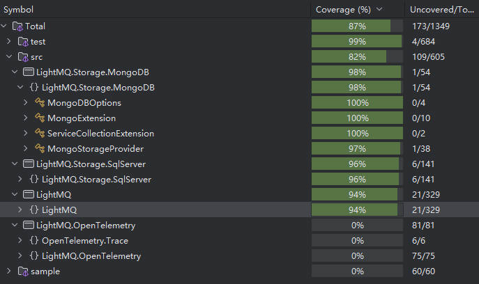

# LightMQ

[English](README.md) | [中文](./README_CN.md)

## 介绍

基于数据库的消息队列，目前支持的数据库：

1. MongoDB
2. SqlServer

特性：

1. 支持重试
2. 支持多队列
3. 支持并发消费

## 测试覆盖率



## 使用方式

初始化：

```c#

serviceCollection.AddLightMQ(it =>
{
    // it.UseSqlServer("Data Source=.;Initial Catalog=Test;User ID=sa;Password=Abc12345;");
    it.UseMongoDB("mongodb://localhost:27017","Test");
});

```

新增消费者：

```c#
public class Test2Consumer:IMessageConsumer
{

    public ConsumerOptions GetOptions()
    {
        return new ConsumerOptions()
        {
            ParallelNum = 1,
            Topic = "test"
        };
    }

    public async Task<bool> ConsumeAsync(string message, CancellationToken cancellationToken)
    {
        Console.WriteLine("消费消息"+message);
        await Task.Delay(2_000,cancellationToken);
        return true;
    }

  
}
```

注册消费者：

```C#
builder.Services.AddScoped<TestConsumer>();
```

## 消费者配置

```c#
public class ConsumerOptions
{
    /// <summary>
    /// 主题
    /// </summary>
    public string Topic { get; set; }
    
    /// <summary>
    /// 开启随机队列消费
    /// </summary>
    public bool EnableRandomQueue {get;set;}
    
    /// <summary>
    /// 拉取间隔
    /// </summary>
    public TimeSpan PollInterval { get; set; }=TimeSpan.FromSeconds(2);

    /// <summary>
    /// 重试次数(不包括第一次执行)
    /// </summary>
    public int RetryCount { get; set; } = 0;

    /// <summary>
    /// 重试间隔
    /// </summary>
    public TimeSpan RetryInterval { get; set; }=TimeSpan.FromSeconds(5);
    
    /// <summary>
    /// 并发数量
    /// </summary>
    public int ParallelNum { get; set; }
}
```

更多可以查看Sample示例
